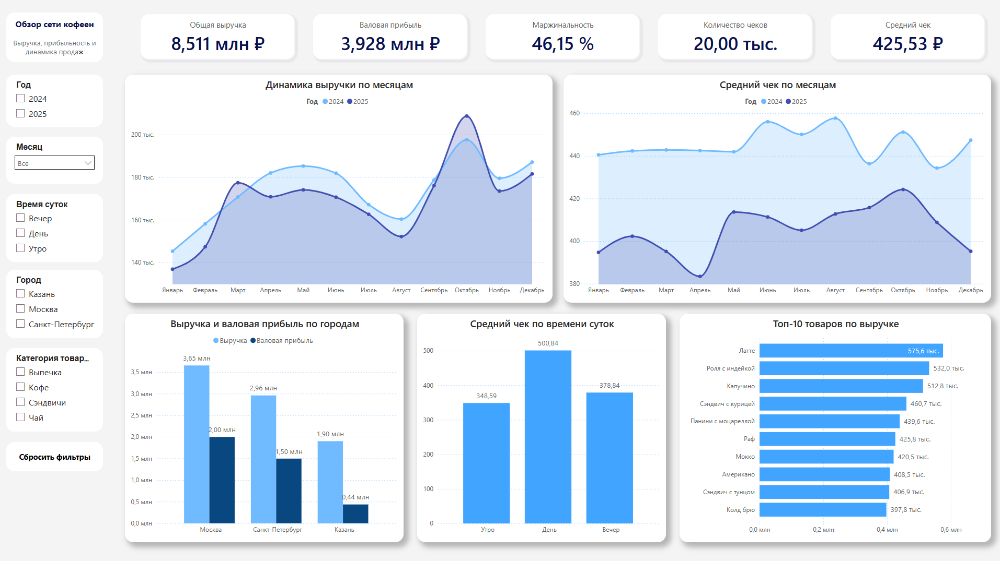
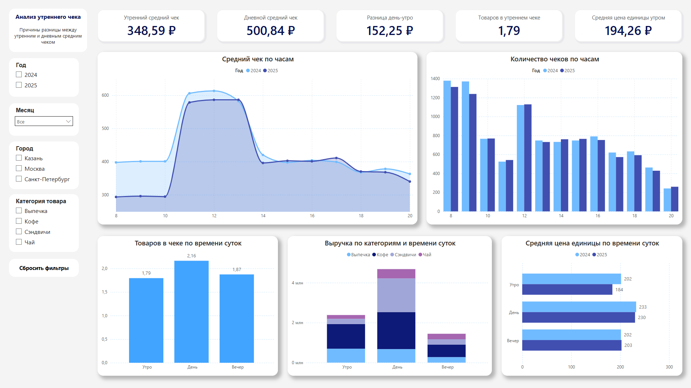
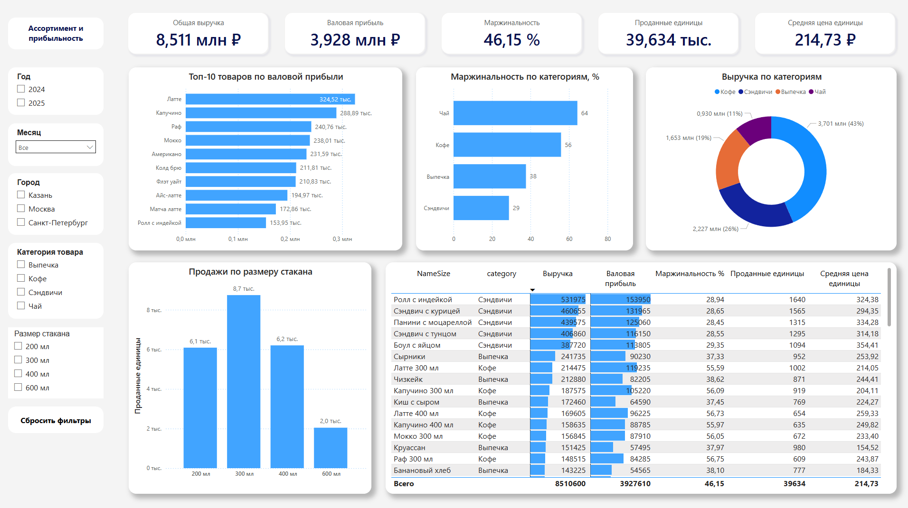

# Dashboard аналитики сети кофеен

Power BI dashboard для анализа продаж сети кофеен.

## Что внутри

- анализ выручки и среднего чека;
- сравнение кофеен по городам;
- анализ утреннего чека;
- ассортимент и прибыльность;
- DAX-метрики и модель данных.

## Скриншоты

### Сводка

### Анализ утреннего чека

### Ассортимент и прибыльность

## Инструменты

Power BI, DAX, Power Query, Data Modeling, Data Visualization.
